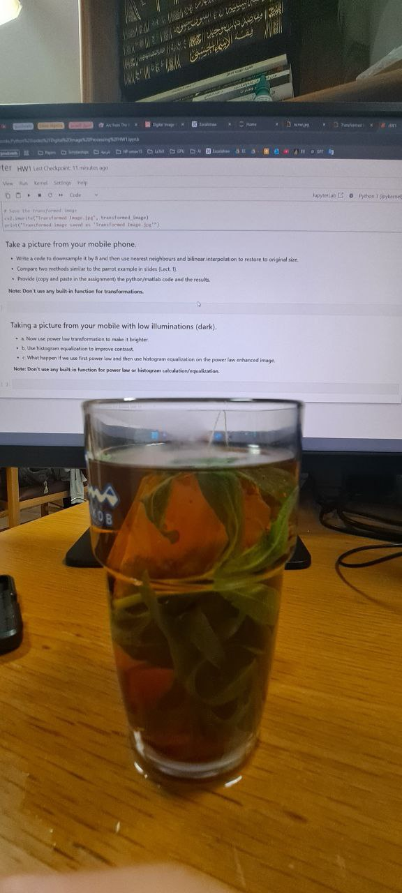
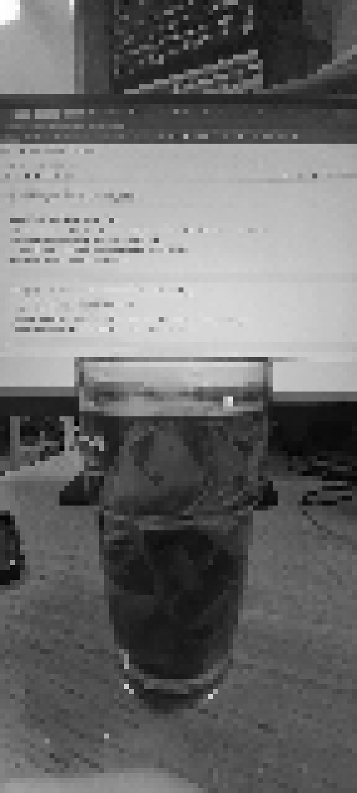
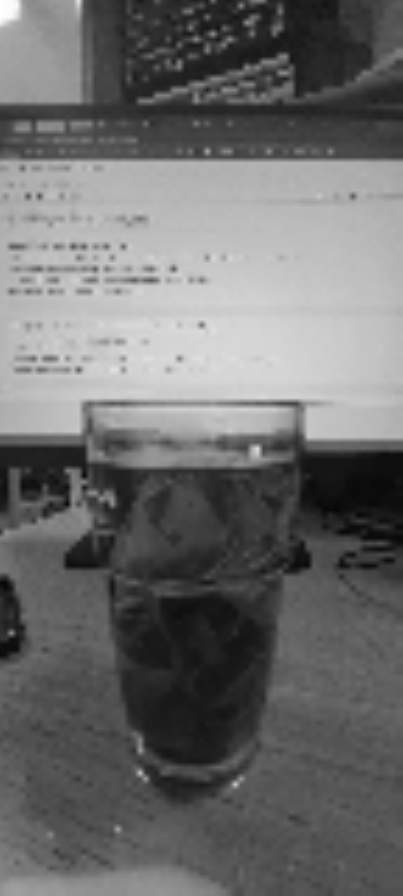

# Downsampling & Interpolation

This project demonstrates **image downsampling** and how interpolation techniques restore the image to its original size.

## 🔹 Transformations Used
- **Downsampling**: Reduces image size by keeping only 1 pixel every `N` pixels.
- **Nearest Neighbor Interpolation**: Restores image by repeating the closest pixel value.
- **Bilinear Interpolation**: Uses weighted averaging for smoother results.

## 🚀 How It Works
1. The user selects a **downsampling factor**.
2. The image is **downsampled** by keeping 1 pixel every `N` pixels.
3. Two interpolation methods restore the original size:
   - **Nearest Neighbor**: Copies the nearest pixel.
   - **Bilinear Interpolation**: Averages neighboring pixels for smoother transitions.

## 📌 How to Run
```bash
python downsampling_interpolation.py
```
The program will prompt you to select a **downsampling factor**.

## 📸 Example Outputs
| Transformation | Example |
|---------------|---------|
| **Original Image** |  |
| **Downsampled Image** |  |
| **Nearest Neighbor Interpolation** |  |
| **Bilinear Interpolation** |  |

## 📌 Requirements
- Python 3.x
- OpenCV (`cv2`)
- NumPy
- Matplotlib

Install dependencies using:
```bash
pip install numpy opencv-python matplotlib
```

## 📝 Notes
⚠ **Matplotlib scales all images to the same display size**, so check the saved images for accurate visualization.

✅ The transformed images are saved as:
- `Downsampled_Image.jpg`
- `Nearest_Neighbor_Image.jpg`
- `Bilinear_Image.jpg