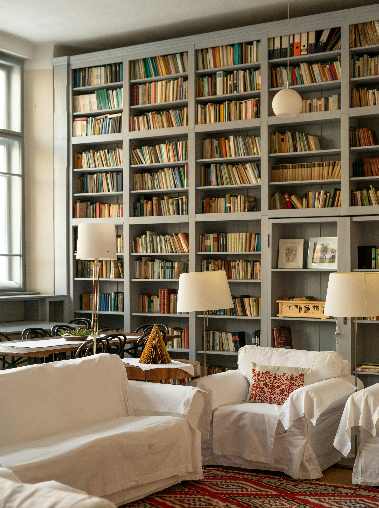

# Image Downsampling and Interpolation Analysis

This tool provides comprehensive analysis of image downsampling and interpolation methods, showing how different combinations affect image quality.

## Quick Start

Run the analysis with:

```
python Auto_Downsampling_Analysis.py sample.jpg --factor 8
```

This will process your image using 12 different method combinations and generate detailed comparisons.

## Results Summary

Analysis results for `sample.jpg` with downsampling factor 8:

| Method Combination | PSNR (dB) | SSIM |
|-------------------|-----------|------|
| **Area-based + Lanczos** | **27.88** | **0.766** |
| Area-based + Bicubic | 27.77 | 0.765 |
| Area-based + Bilinear | 26.97 | 0.754 |
| Anti-aliased + Lanczos | 26.16 | 0.746 |
| Anti-aliased + Bicubic | 26.13 | 0.746 |
| Anti-aliased + Bilinear | 25.77 | 0.739 |
| Area-based + Nearest Neighbor | 25.75 | 0.699 |
| Simple + Bilinear | 25.19 | 0.731 |
| Simple + Bicubic | 24.84 | 0.718 |
| Simple + Lanczos | 24.67 | 0.708 |
| Anti-aliased + Nearest Neighbor | 24.41 | 0.683 |
| Simple + Nearest Neighbor | 23.07 | 0.638 |

> **Best overall:** Area-based downsampling + Lanczos interpolation

## Visual Comparison

### Original Image


### Downsampling & Interpolation Methods
The following table shows the up-sampled result of the down-sampled `sample.png` for different method combinations:

| Downsampling | Nearest Neighbor | Bilinear | Bicubic | Lanczos |
|-------------|-----------------|----------|---------|---------|
| **Simple** | _Nearest_Neighbor.jpg) | _Bilinear.jpg) | _Bicubic.jpg) | _Lanczos.jpg) |
| **Anti-aliased** | _Nearest_Neighbor.jpg) | _Bilinear.jpg) | _Bicubic.jpg) | _Lanczos.jpg) |
| **Area-based** |  |  |  |  |

### Performance Heatmaps


## Understanding the Results

### Image Quality Metrics

- **PSNR (Peak Signal-to-Noise Ratio)**: Higher is better. Measures pixel-level accuracy.
- **SSIM (Structural Similarity Index)**: Higher is better. Measures perceived quality.

### Method Descriptions

#### Downsampling Methods:
- **Simple**: Basic pixel skipping - fast but prone to aliasing
- **Anti-aliased**: Gaussian blur before downsampling - reduces artifacts
- **Area-based**: Averages pixel regions - usually best for photographs

#### Upsampling (Interpolation) Methods:
- **Nearest Neighbor**: Fast but blocky
- **Bilinear**: Smoother than NN, good balance of speed/quality
- **Bicubic**: Better edge preservation than bilinear
- **Lanczos**: High quality with sharp edges, but slower

## Output Files

The script creates a timestamped folder with:

- **images/** - Individual result images
- **plots/** - Comparison visualizations
- **results_summary.csv** - Complete metrics table

## Requirements

- Python 3.6+
- OpenCV
- NumPy
- Matplotlib
- scikit-image