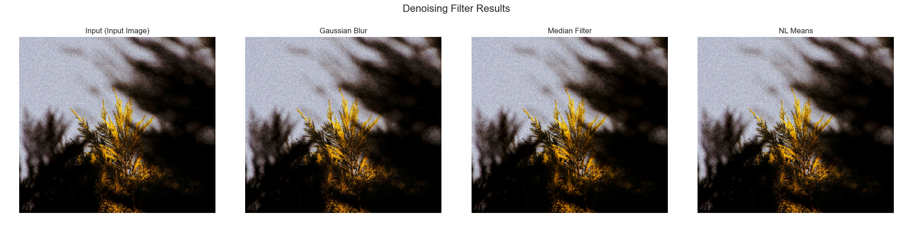
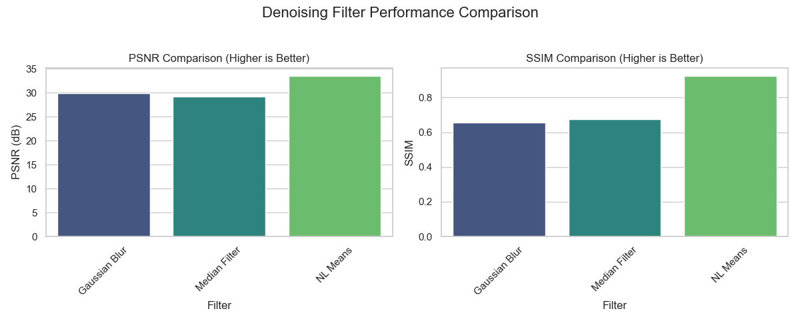

# NoiseDetective: Image Noise Analysis and Removal Tool

[](https://www.python.org/downloads/)
[](https://github.com/psf/black)
[](https://flake8.pycqa.org/en/latest/)

A flexible Python tool using OpenCV, Scikit-image, and Matplotlib/Seaborn to analyze, visualize, and remove common image noise types. It compares classic denoising filters (Gaussian Blur, Median, Non-Local Means) and evaluates their performance.

This project demonstrates image processing techniques and configurable analysis pipelines in Python, allowing users to work with sample images or their own data.

## Features

- Load standard images or a custom user-provided image (e.g., `sample.jpg`).
- **Option 1:** Add synthetic Gaussian or Salt & Pepper noise for controlled testing.
- **Option 2:** Process an image assumed to be already noisy.
- Apply common denoising filters with tunable parameters:
    - Gaussian Blur
    - Median Filter
    - Non-Local Means (NLM)
    - (Easily extensible with other filters like TV Chambolle)
- Calculate image quality metrics (PSNR & SSIM) when synthetic noise is added (requires a clean reference).
- Visualize results:
    - Image comparisons (Input vs. Denoised versions).
    - Pixel intensity histograms.
    - Bar charts comparing filter performance metrics (if applicable).
- Save generated plots to the `/figures` directory.
- Save final denoised images to the `/output_images` directory.

## Project Structure

```
noise-detective/
├── sample.jpg       # <-- Place your input image here (optional)
├── .gitignore
├── LICENSE
├── Makefile         # Automation scripts (install, test, lint, run)
├── README.md
├── figures/         # Output plots saved here
├── notebooks/
│   └── noise_analysis_demo.ipynb  # Main analysis and demo
├── output_images/   # Denoised images saved here
├── requirements.txt # Python dependencies
└── tests/           # Unit tests
```

## Setup and Installation

1.  **Clone the repository:**
    ```bash
    git clone [https://github.com/](https://github.com/)nahmad2000/noise-detective.git
    cd noise-detective
    ```

2.  **Place your image (Optional):** If you want to use your own image, place it in the main `noise-detective` directory (e.g., name it `sample.jpg` or `sample.png`).

3.  **Create a virtual environment (recommended):**
    ```bash
    python -m venv venv
    source venv/bin/activate  # On Windows use `venv\Scripts\activate`
    ```

4.  **Install dependencies:**
    ```bash
    make install
    # Or: pip install -r requirements.txt
    ```

5.  **(Optional) Setup pre-commit hooks:**
    ```bash
    make setup-hooks
    ```

## Usage

The main analysis is performed within the Jupyter notebook `notebooks/noise_analysis_demo.ipynb`.

1.  **Configure the Notebook:** Open the notebook and **edit the Configuration Flags** at the top of the first code cell:
    * `USE_CUSTOM_IMAGE`: Set to `True` to use your image (e.g., `sample.jpg`), `False` to use the default astronaut image.
    * `CUSTOM_IMAGE_NAME`: If `USE_CUSTOM_IMAGE=True`, set this to your image's filename (e.g., `"sample.jpg"`).
    * `ADD_NOISE`: Set to `True` if your input image is clean and you want to add synthetic noise before denoising. Set to `False` if your input image is already noisy and you want to denoise it directly.

2.  **Run the Notebook:**
    * **Interactively:** Start Jupyter (`jupyter notebook` or `jupyter lab`), open the notebook, and run the cells sequentially.
    * **Non-interactively:** Use the Makefile command:
        ```bash
        make run
        ```

## Expected Output

Running the notebook will:

1.  Load the specified image (custom or default).
2.  Optionally add synthetic noise.
3.  Apply denoising filters (parameters can be tuned in Section 2 functions).
4.  Optionally calculate and print PSNR/SSIM metrics (if `ADD_NOISE=True`).
5.  Save analysis plots to the `/figures` directory.
6.  Save the resulting denoised images to the `/output_images` directory (e.g., `sample_denoised_median.png`).

### Example Output Plots

*(Note: These are representative plots based on running with ADD_NOISE=True. Your specific results depend on the input image and parameters.)*

**Denoising Results Comparison:** Shows the input (noisy) image alongside images processed by different filters.


**Filter Performance Metrics (PSNR/SSIM):** Compares quantitative quality metrics for each filter against the original clean image. (Only generated if `ADD_NOISE=True`).


## Development & Testing

- **Formatting:** `make format` (uses `black`)
- **Linting:** `make lint` (uses `flake8` and `black --check`)
- **Testing:** `make test` (uses `pytest` with coverage)

*(Note: Tests primarily cover basic function execution. Parameter tuning and visual inspection are crucial for evaluating denoising quality.)*