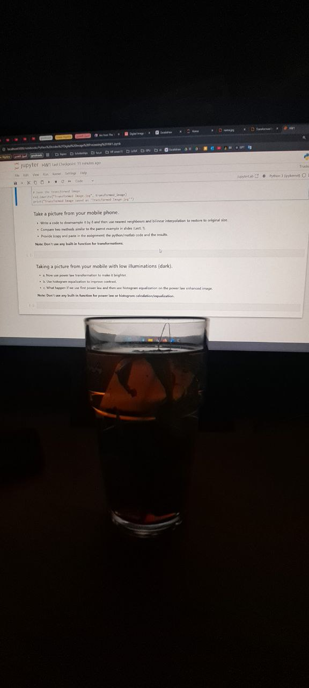
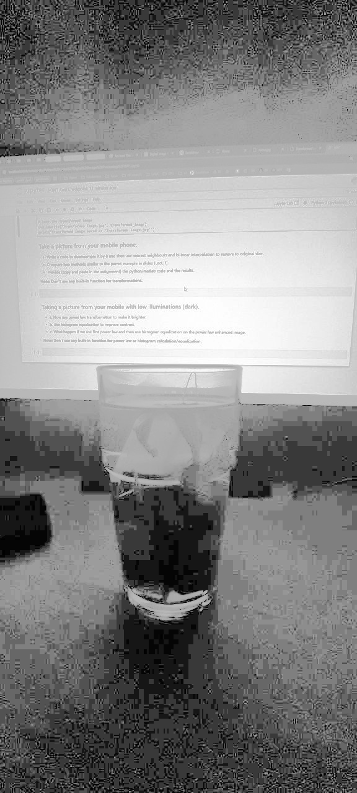

# Image Enhancement

This project applies **image enhancement techniques** to improve image brightness and contrast.

## 🔹 Enhancement Methods Used
- **Power Law Transformation (Gamma Correction)**:
  - Formula: `s = c * r^γ`
  - Adjusts brightness by varying `γ` (gamma).
  - `γ < 1`: Brightens the image.
  - `γ > 1`: Darkens the image.
- **Histogram Equalization**:
  - Enhances contrast by redistributing pixel intensities.
  - Spreads out intensity levels for a more balanced image.

## 🚀 How It Works
1. The user inputs `γ` (gamma) and `c` values for **Power Law Transformation**.
2. The program applies **Power Law Transformation** to adjust brightness.
3. **Histogram Equalization** is applied to enhance contrast.
4. The final result is a **Power Law + Histogram Equalized** image.

## 📌 How to Run
```bash
python image_enhancement.py
```
The program will guide you through selecting enhancement parameters.

## 📸 Example Outputs
| Transformation | Example |
|---------------|---------|
| **Original Image** |  |
| **Power Law Transformation** |  |
| **Histogram Equalization** |  |

## 📌 Requirements
- Python 3.x
- OpenCV (`cv2`)
- NumPy
- Matplotlib

Install dependencies using:
```bash
pip install numpy opencv-python matplotlib
```

## 📝 Notes
⚠ **Matplotlib scales all images to the same display size**, so check the saved images for correct visualization.

✅ The enhanced images are saved as:
- `Power_Image.jpg`
- `Histogram_Image.jpg`
- `Power_Histogram_Image.jpg`
