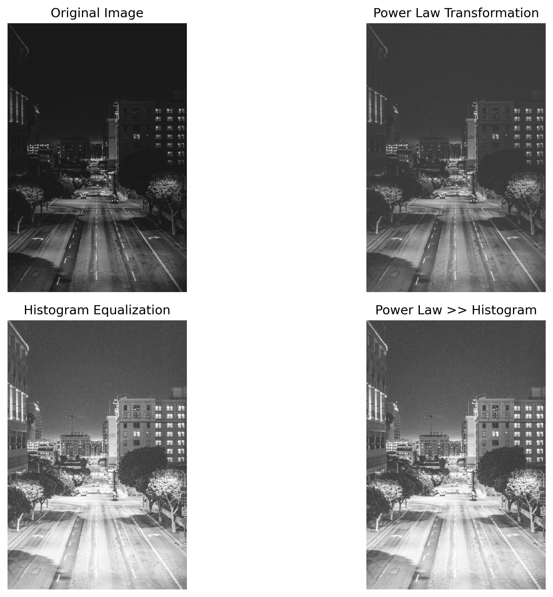
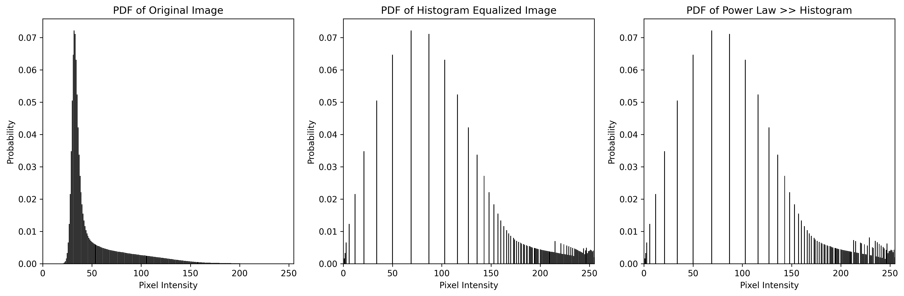

# Image Enhancement Tool

A simple yet powerful Python tool for enhancing dark or low-contrast images using Power Law Transformation (Gamma Correction) and Histogram Equalization techniques.



## Features

- **Power Law Transformation**: Adjusts image brightness using the formula `s = c * r^γ`
- **Histogram Equalization**: Improves contrast by redistributing pixel intensities
- **Combined Enhancement**: Apply both techniques sequentially for optimal results
- **Interactive Mode**: Guided parameter selection with explanations
- **Command-Line Support**: Batch processing capability with customizable parameters

## Installation

1. Clone this repository:
   ```
   git clone https://github.com/yourusername/image-enhancement-tool.git
   cd image-enhancement-tool
   ```

2. Install required packages:
   ```
   pip install numpy opencv-python matplotlib
   ```

## Usage

### Interactive Mode

```
python image_enhancer.py
```

Follow the prompts to:
1. Select your image file
2. Set gamma (γ) and constant (c) values 
3. View and save enhanced images

### Command-Line Mode

```
python image_enhancer.py --image path/to/image.jpg --gamma 0.5 --constant 1.0
```

#### Command-Line Arguments

| Argument | Short | Description | Default |
|----------|-------|-------------|---------|
| `--image` | `-i` | Path to input image | (Required in CLI mode) |
| `--gamma` | `-g` | Gamma value (0 < γ < 1 brightens) | (Required in CLI mode) |
| `--constant` | `-c` | Constant multiplier | 1.0 |
| `--output` | `-o` | Output directory | "enhanced_images" |
| `--no-display` | - | Don't show images/plots | False |
| `--no-save` | - | Don't save enhanced images | False |

## How It Works

### Power Law Transformation

The power law transformation is defined by the formula:
```
s = c * r^γ
```
Where:
- `r` is the original pixel value
- `s` is the transformed pixel value
- `γ` (gamma) controls brightness (γ < 1 brightens, γ > 1 darkens)
- `c` is a constant multiplier

### Histogram Equalization

This technique improves contrast by:
1. Computing the image histogram
2. Creating a cumulative distribution function (CDF)
3. Mapping original pixel values to new values according to the CDF

### Example Results

Original Image vs. Enhanced Image:



The probability density function (PDF) plots show how pixel intensity distribution changes after applying enhancements.

## Tips for Optimal Results

- For dark images, try γ values between 0.3 and 0.7
- For extremely dark images, start with γ = 0.4 and c = 1.2
- The combined "Power Law >> Histogram" enhancement typically gives the best results