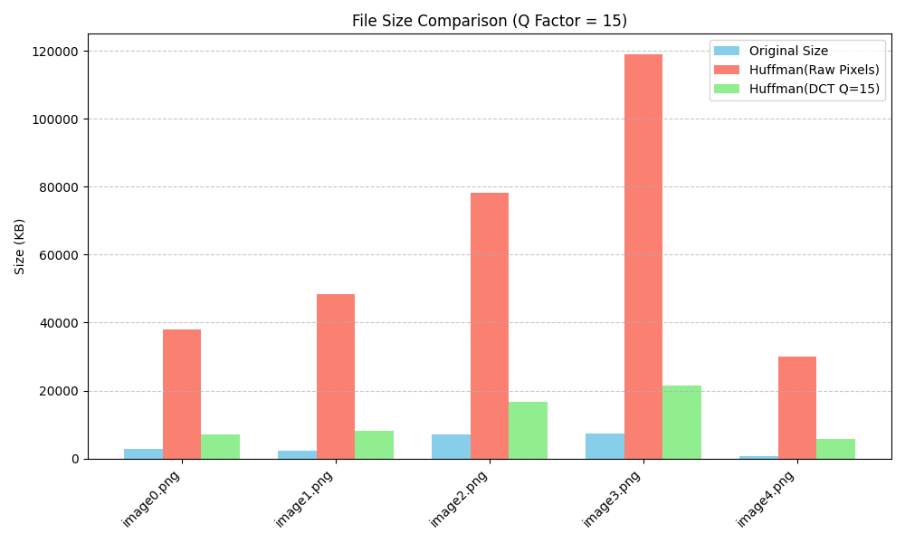

# 🖼️ Huffman-Based Image Compression with DCT Comparison

## 📌 Project Overview

This project explores two lossless image compression strategies in Python:

1. **Huffman encoding on raw pixel data**
2. **Huffman encoding on quantized DCT (Discrete Cosine Transform) coefficients**

The goal is to demonstrate and compare their effectiveness in terms of **compression ratio**, **storage size**, and **execution time**. Results are visualized via bar plots for quick analysis.

---

## 💡 Key Concepts

### Huffman Coding

A classic entropy encoding algorithm that assigns shorter binary codes to more frequent symbols and longer codes to rarer ones — achieving efficient, **lossless** compression.

### DCT + Quantization

Inspired by JPEG compression, the Discrete Cosine Transform expresses image data in frequency space, and quantization reduces precision for less-perceptible components. When combined with Huffman coding, this can lead to better compression for certain images.

---

## 🚀 Features

- ✅ Supports **grayscale and RGB** lossless formats (e.g., PNG, BMP)
- 📉 Compares **raw vs. DCT-based compression** with size and ratio metrics
- 📊 Generates **bar plots** to visualize file size reductions
- ⚙️ Easy to customize with CLI options (quantization, formats, etc.)
- 🧪 Clean separation of logic, results, and plotting
- 📁 Output directory stores all encoded files and figures

---

## 🛠️ Requirements

Install required dependencies:

```bash
pip install numpy opencv-python matplotlib scipy
```

---

## 🧪 Usage

Place your PNG/BMP images in an input folder (`images/` by default). Then run:

```bash
python main.py --input_dir images --output_dir results --q_factor 10
```

**Optional arguments:**

- `--q_factor` : Controls DCT quantization strength (higher = more compression)
- `--img_format` : Change file search format (default: png)

---

## 📋 Sample Results


📊 **Compression Ratio = Original Size / Compressed Size**  
Higher ratio = better compression

---

## 📈 Example Plot Output



Each image is compared across:
- 🔷 Original file size
- 🔶 Raw Huffman-encoded size
- 🟢 DCT-compressed (quantized) + Huffman-encoded size

---

## 🧠 How It Works (Simplified)

1. **Image is loaded** via OpenCV
2. **Raw Huffman Encoding** applied to pixel values
3. **DCT Encoding**:
    - Convert to frequency space via 2D DCT
    - Quantize coefficients
    - Apply Huffman encoding to coefficients
4. **Compression Results Calculated**
5. **Bar Plot Generated** (if matplotlib is available)

---

## ✅ TODO & Enhancements

-  Add Huffman decoding + image reconstruction
-  Support multi-threaded processing for large datasets
-  Improve DCT block processing (e.g., 8x8 blocks like JPEG)
-  Store Huffman dictionaries for optional decoding

---
