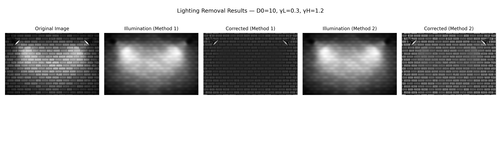

# Lighting Removal Using Frequency-Domain Filtering

This project implements two frequency-domain methods to remove lighting gradients from a grayscale image using high-pass filtering. The script outputs both estimated illumination and corrected (lighting-removed) versions, along with a visual comparison.

## 📂 Input
- Grayscale wall image with lighting effect
- Example: `wall_original.png`

## 📈 Output
The script produces and saves the following images:

| Method      | Illumination Estimate     | Corrected Output            |
|-------------|----------------------------|-----------------------------|
| **Method 1** | `illumination_code1.png`   | `corrected_code1.png`       |
| **Method 2** | `illumination_code2.png`   | `corrected_code2.png` (CLAHE Enhanced) |

Additionally, a side-by-side comparison image is saved:
- `comparison_plot.png`



---

## 🚀 How to Run

1. Make sure Python is installed with the required dependencies (see below)
2. Place your grayscale wall image and name it accordingly (e.g., `wall_original.png`)
3. Adjust the `image_path` at the top of the script to point to your image
4. Run the script:

```bash
python lighting_removal.py
```

---

## 🔧 Dependencies
Install using pip:
```bash
pip install numpy opencv-python matplotlib
```

---

## ⚙️ Tunable Parameters
All parameters are declared at the top of the script:

```python
D0 = 10  # Gaussian cutoff frequency (lower = stronger filtering)
gamma_L = 0.3  # Gain for low frequencies (increase = brighter base)
gamma_H = 1.2  # Gain for high frequencies (increase = more contrast)
clahe_clip_limit = 2.0  # CLAHE contrast enhancement strength
clahe_tile_size = (8, 8)  # CLAHE tile size (smaller = more local contrast)
```

These allow full control over both filter strength and post-enhancement quality.

---

## 🧠 Method Summary

### Method 1: Basic Filtering
- Applies a Gaussian high-pass filter in the frequency domain
- No gain adjustment, no post-processing

### Method 2: Homomorphic + CLAHE
- Applies a modified homomorphic filter with gain control (`gamma_L`, `gamma_H`)
- Applies CLAHE to enhance local contrast adaptively


