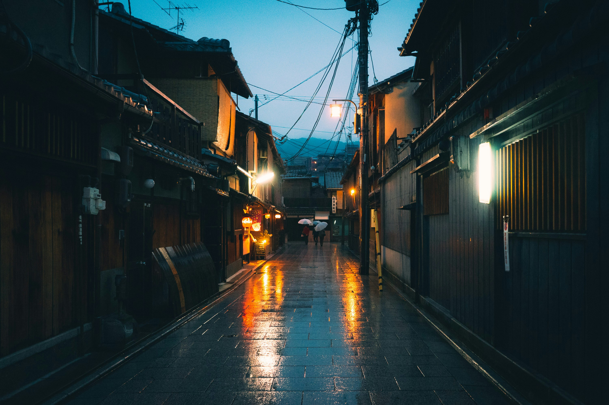
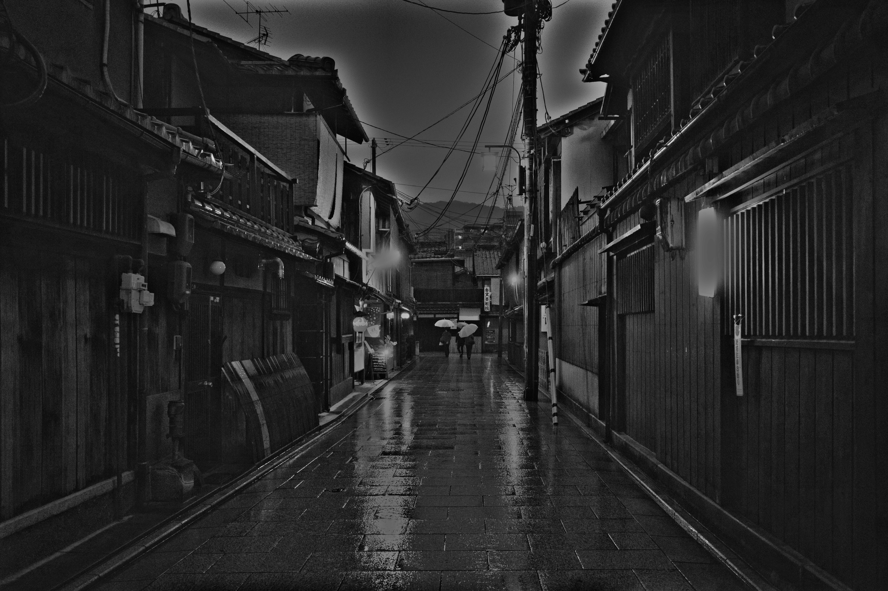
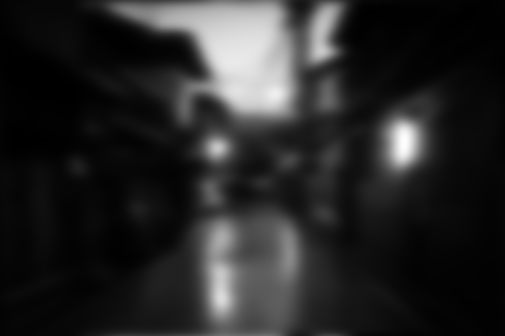
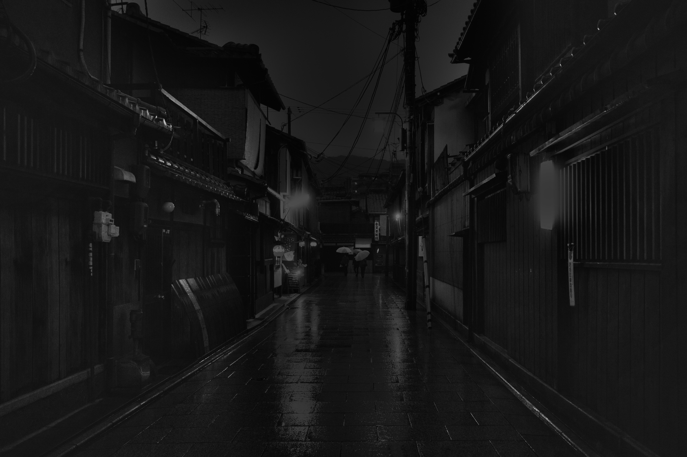
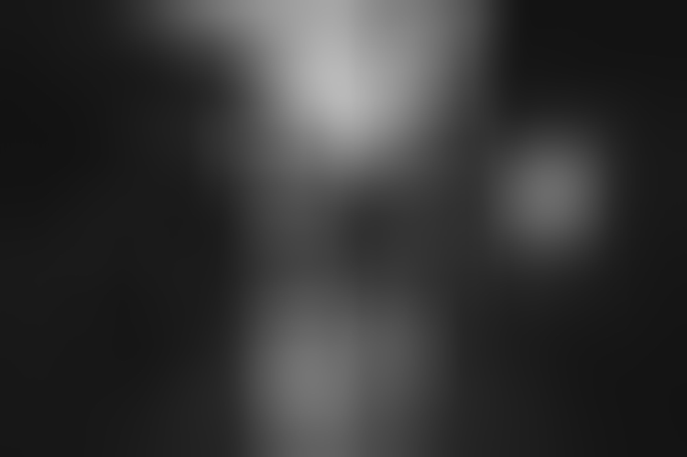

# Image Lighting Correction Tool

A Python tool for correcting uneven lighting in images using both spatial and frequency domain approaches.

## Example Results

<table border="1" cellpadding="8">
  <tr>
    <th>Original</th>
    <th>Frequency Corrected</th>
    <th>Frequency Illumination</th>
    <th>Spatial Corrected</th>
    <th>Spatial Shading</th>
  </tr>
  <tr>
    <td></td>
    <td></td>
    <td></td>
    <td></td>
    <td></td>
  </tr>
</table>

## Features

- **Multiple Correction Methods:**
  - **Spatial Domain**: Fast correction using Gaussian blur (ideal for mild lighting issues)
  - **Frequency Domain**: Advanced homomorphic filtering (better for complex lighting problems)

- **User-Friendly Interface:**
  - Simple command-line usage
  - Automatic parameter selection with manual override options
  - Visual comparison of results

- **Flexible Output:**
  - Save corrected images
  - Generate comparison visualizations
  - Extract lighting/shading components

## Requirements

- Python 3.6+
- OpenCV (`opencv-python`)
- NumPy
- Matplotlib

Install dependencies:

```bash
pip install opencv-python numpy matplotlib
```

## Quick Start

```bash
# Basic usage with default parameters (frequency domain method)
python lighting_correction.py path/to/your/image.jpg

# Try spatial domain method
python lighting_correction.py path/to/your/image.jpg --method spatial

# Compare both methods
python lighting_correction.py path/to/your/image.jpg --method both

# Customize frequency domain parameters
python lighting_correction.py path/to/your/image.jpg --d0 15 --gamma-l 0.2 --gamma-h 1.5
```

## Methods Explained

### Spatial Domain Method

Uses Gaussian blur to estimate lighting variation, then normalizes the image by dividing by this estimate.

- **Advantages**: Fast, simple, works well for mild lighting issues
- **Disadvantages**: Less effective for complex lighting patterns

Parameters:
- `--kernel-size`: Size of Gaussian kernel (default: auto-calculated based on image size)
- `--sigma`: Standard deviation for Gaussian blur (default: auto-calculated)

### Frequency Domain Method (Homomorphic Filtering)

Uses Fourier transforms to separate lighting (low frequency) from texture (high frequency).

- **Advantages**: Better separation of lighting and texture, more control
- **Disadvantages**: More complex, slower

Parameters:
- `--d0`: Cutoff frequency (default: 10)
  - Lower values → more aggressive lighting removal
  - Higher values → softer correction
- `--gamma-l`: Low frequency gain (default: 0.3)
  - Controls how much lighting to preserve
  - Lower values → less lighting
- `--gamma-h`: High frequency gain (default: 1.2)
  - Controls texture/detail enhancement
  - Higher values → more texture contrast
- `--clahe-clip`, `--clahe-tile`: CLAHE enhancement parameters
- `--no-clahe`: Disable CLAHE enhancement

## Example Usage Scenarios

### Basic Correction

```bash
python lighting_correction.py image.jpg
```

### Aggressive Lighting Removal

```bash
python lighting_correction.py image.jpg --d0 5 --gamma-l 0.1
```

### Enhance Texture Details

```bash
python lighting_correction.py image.jpg --gamma-h 1.8 --clahe-clip 3.0
```

### Full Parameter Set

```bash
python lighting_correction.py image.jpg \
  --method frequency \
  --output results_folder \
  --d0 8 \
  --gamma-l 0.25 \
  --gamma-h 1.5 \
  --clahe-clip 2.5 \
  --clahe-tile 4
```

## Full Command-Line Reference

```
usage: lighting_correction.py [-h] [--method {spatial,frequency,both}]
                             [--output OUTPUT] [--no-plot] [--no-save]
                             [--kernel-size KERNEL_SIZE] [--sigma SIGMA]
                             [--d0 D0] [--gamma-l GAMMA_L] [--gamma-h GAMMA_H]
                             [--no-clahe] [--clahe-clip CLAHE_CLIP]
                             [--clahe-tile CLAHE_TILE]
                             image_path

Lighting Correction for Images

positional arguments:
  image_path            Path to the input image

optional arguments:
  -h, --help            show this help message and exit
  --method {spatial,frequency,both}
                        Correction method to use (default: frequency)
  --output OUTPUT, -o OUTPUT
                        Directory to save results (default: results)
  --no-plot             Disable visualization plot
  --no-save             Do not save results to disk
  --kernel-size KERNEL_SIZE
                        Kernel size for Gaussian blur (spatial method)
  --sigma SIGMA         Sigma value for Gaussian blur (spatial method)
  --d0 D0               Cutoff frequency for Gaussian filter (frequency method)
  --gamma-l GAMMA_L     Low frequency gain (frequency method)
  --gamma-h GAMMA_H     High frequency gain (frequency method)
  --no-clahe            Disable CLAHE enhancement (frequency method)
  --clahe-clip CLAHE_CLIP
                        CLAHE clip limit (frequency method)
  --clahe-tile CLAHE_TILE
                        CLAHE tile size (frequency method)
```

## As a Python Library

You can also use the tool as a Python library:

```python
from lighting_correction import LightingCorrection

# Create the correction object
corrector = LightingCorrection()

# Apply correction using frequency domain method
results = corrector.apply_correction(
    'path/to/image.jpg',
    method='frequency',
    params={
        'd0': 12,
        'gamma_l': 0.2,
        'gamma_h': 1.5
    }
)

# Access results
corrected_image = results['frequency_corrected']
illumination = results['frequency_illumination']
```

## Notes on Parameter Selection

- For **harsh lighting conditions** (strong spotlights, extreme shadows):
  - Frequency method with `--d0 5 --gamma-l 0.1 --gamma-h 1.4`

- For **subtle lighting issues**:
  - Spatial method with larger kernel size
  - OR frequency method with `--d0 20 --gamma-l 0.4`

- For **enhancing visibility of details**:
  - Increase `--gamma-h` to 1.5-2.0
  - Increase CLAHE clip limit to 3.0-4.0
